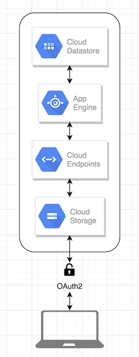

# Commands to generate and deploy endpoints, then deploy code:
	mvn endpoints-framework:openApiDocs -e
	gcloud endpoints services deploy target/openapi-docs/openapi.json
	mvn appengine:update

# Command to upload with the no-cache header
	gsutil -h "Cache-Control:no-cache" cp bucket/index.html gs://list-demo/index.html

# Bring front end up locally
	sudo live-server --port=80

# Files
- pom.xml
- src/main/webapp/WEB-INF/appengine-web.xml
- src/main/webapp/WEB-INF/web.xml
- src/main/java/com/epamx/sharingIsCaring/endpoints/TaskList.java
- src/main/java/com/epamx/sharingIsCaring/endpoints/Task.java
- src/main/java/com/epamx/sharingIsCaring/endpoints/Result.java

# Architectural diagram

# Notes
	https://swagger.io/
	Standard API definitions can get you automatic documentation, code and developer portals. 
	We need accuracy, expressiveness and readibility from an API contract: https://youtu.be/bR9hEyZ9774?t=759

# References
- https://cloud.google.com/endpoints/docs/frameworks/java/adding-api-management
- https://cloud.google.com/endpoints/docs/frameworks/java/set-up-environment
- https://github.com/GoogleCloudPlatform/appengine-endpoints-helloworld-java-maven/blob/master/pom.xml
- https://github.com/GoogleCloudPlatform/getting-started-java/blob/master/appengine-standard-java8/helloworld/pom.xml
- https://cloud.google.com/endpoints/docs/frameworks/java/annotations